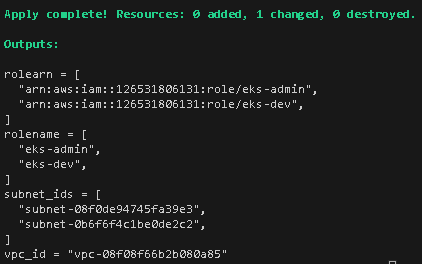
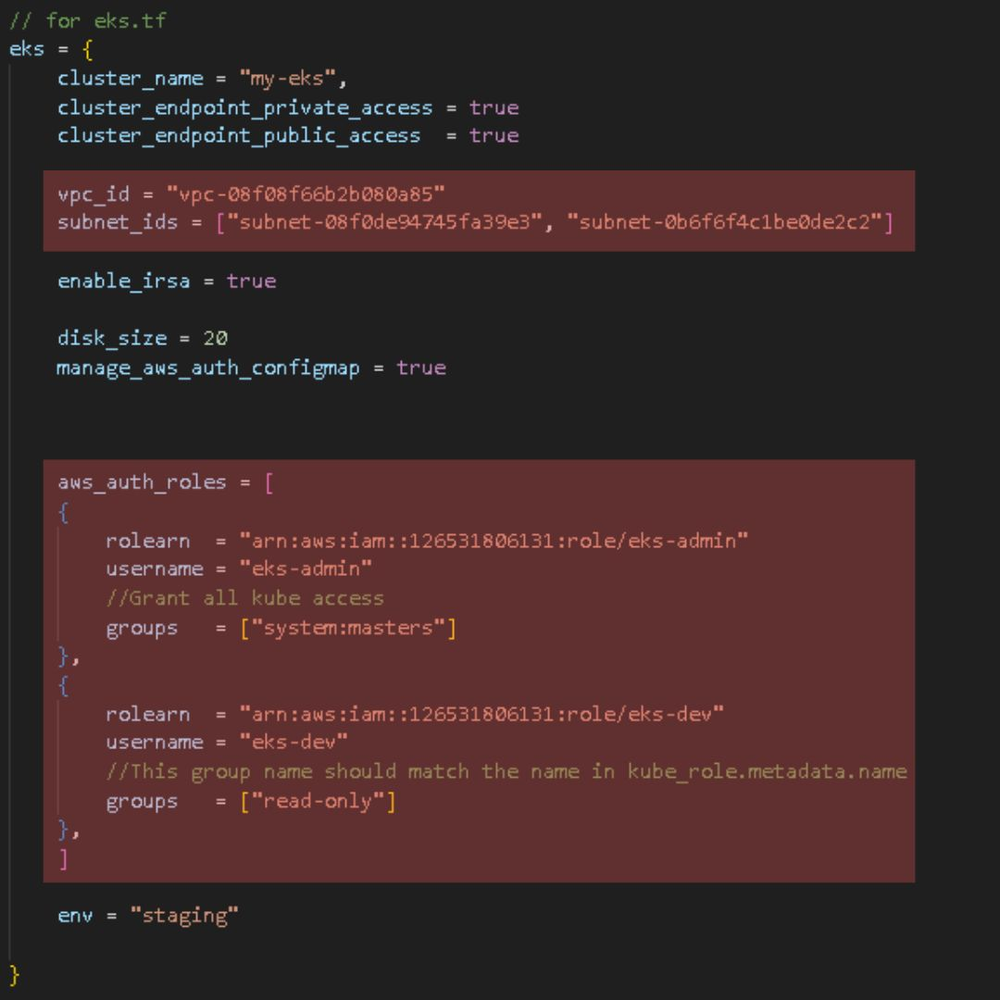

## Usage

This repository is designed to help you create an Elastic Kubernetes Service (EKS) on AWS. It automates the creation of the necessary components for setting up an EKS cluster, and you can easily configure it by editing the .tfvars file.

1.Eks cluster

2.NodeGroup

3.Group User

4.User

5.Vpc

6.Subnet

7.Nat gateway

## How to
Here are the steps to follow in order to use this repository:

1.You need to authorize with the aws in someway in this case you can add your access_key and secret key in ./eks/terraform.tfvars and ./iam/terraform.tfvars

2.Get into "iam" folder and make changes to the values and policies as desired. You can add multiple users and groups according to your requirements.

3.Run "terraform init", "terraform plan" and "terraform apply" after run all those command copy the output values. You will need these values in the next step.
 

<b>Example Outputs</b>
 
    
 

4.Get into "eks" folder, open terraform.tfvars file, place the copied value and edit any value as you want. Note that if you have changed the kube_role.name, ensure that eks.aws_auth_roles.groups have the same name.

<b>Example</b>
 
    
 

5.Run "terraform init", "terraform plan" and "terraform apply" This will create the EKS cluster based on your configuration.

6.To test the result run following command (assuming you haven't changed any default values)

<b> Basic Testing </b>

    aws eks update-kubeconfig --name my-eks --region us-east-1
    # To get all kubernetes services
    kubectl get svc

<b> Test Eks policy </b>

You need to create a credential key for a specific user to test the policy.
Use the appropriate link for your region to create the credentials.
<a href="https://us-east-1.console.aws.amazon.com/iamv2/home?region=us-east-1#/users" target="_blank">https://us-east-1.console.aws.amazon.com/iamv2/home?region=us-east-1#/users</a>

    aws configure --profile admin1
    # place you accesskey ,secretkey and other

    vim ~/.aws/config
    # add this to config
    [profile eks-admin]
    role_arn = arn:aws:iam::(Your arn id):role/eks-admin
    source_profile = admin1

    aws sts get-caller-identity --profile eks-admin
    # You will get some result if you done it correctly

    aws eks update-kubeconfig --name my-eks --region us-east-1 --profile eks-admin
    # This command will make you run cli by using profile eks-admin (Now you are using admin policy)

    kubectl auth can-i "*" "*"
    # The result should be yes because you are using the group name system:masters

    #To test for our custom policy you need to sign in other user create credential for dev1
    aws configure --profile dev1
    # place you accesskey ,secretkey and other

    vim ~/.aws/config
    # add this to config
    [profile eks-dev]
    role_arn = arn:aws:iam::(Your arn id):role/eks-dev
    source_profile = dev1

    aws eks update-kubeconfig --name my-eks --region us-east-1 --profile eks-dev
    # If you running this command that mean you are using profile dev1 now
    # Try to run
    kubectl auth can-i "*" "*"
    # The result will be no because we can only "get", "list", "watch" on this profile
    kubectl get pods
    # The result will be anything depends on your configure but you are not going to stuck with the error forbidden

## Requirements

| Name | Version |
|------|---------|
|  [aws](#requirement\_aws) | ~> 4.0 |
|  [helm](#requirement\_helm) | >= 2.6.0 |
|  [kubectl](#requirement\_kubectl) | >= 1.7.0 |

## Providers

| Name | Version |
|------|---------|
|  [aws](#provider\_aws) | 4.67.0 |
|  [kubernetes](#provider\_kubernetes) | 2.21.1 |

## Modules

| Name | Source | Version |
|------|--------|---------|
|  [eks](#module\_eks) | terraform-aws-modules/eks/aws | 18.29.0 |
|  [allow\_assume\_eks\_iam\_policy](#module\_allow\_assume\_eks\_iam\_policy) | terraform-aws-modules/iam/aws//modules/iam-policy | 5.3.1 |
|  [allow\_eks\_access\_iam\_policy](#module\_allow\_eks\_access\_iam\_policy) | terraform-aws-modules/iam/aws//modules/iam-policy | 5.3.1 |
|  [create\_iam\_user](#module\_create\_iam\_user) | terraform-aws-modules/iam/aws//modules/iam-user | 5.3.1 |
|  [eks\_iam\_group](#module\_eks\_iam\_group) | terraform-aws-modules/iam/aws//modules/iam-group-with-policies | 5.3.1 |
|  [eks\_iam\_role](#module\_eks\_iam\_role) | terraform-aws-modules/iam/aws//modules/iam-assumable-role | 5.3.1 |
|  [vpc](#module\_vpc) | terraform-aws-modules/vpc/aws | 3.14.3 |

## Resources

| Name | Type |
|------|------|
| [kubernetes_role.example](https://registry.terraform.io/providers/hashicorp/kubernetes/latest/docs/resources/role) | resource |
| [kubernetes_role_binding_v1.example](https://registry.terraform.io/providers/hashicorp/kubernetes/latest/docs/resources/role_binding_v1) | resource |
| [aws_eks_cluster.default](https://registry.terraform.io/providers/hashicorp/aws/latest/docs/data-sources/eks_cluster) | data source |
| [aws_eks_cluster_auth.default](https://registry.terraform.io/providers/hashicorp/aws/latest/docs/data-sources/eks_cluster_auth) | data source |

## Outputs

| Name | Description |
|------|-------------|
|  [rolearn](#output\_rolearn) | n/a |
|  [rolename](#output\_rolename) | n/a |
|  [subnet\_ids](#output\_subnet\_ids) | n/a |
|  [vpc\_id](#output\_vpc\_id) | n/a |
